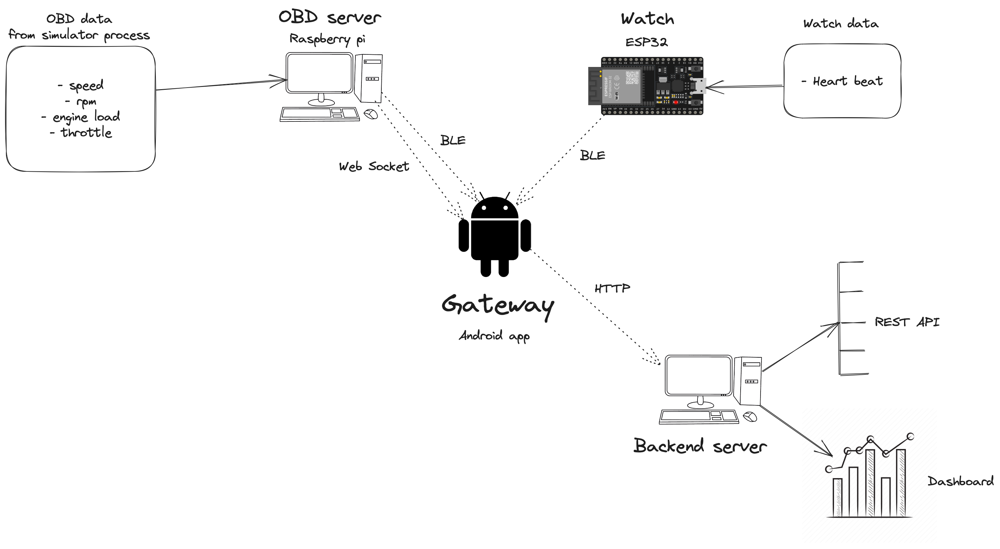
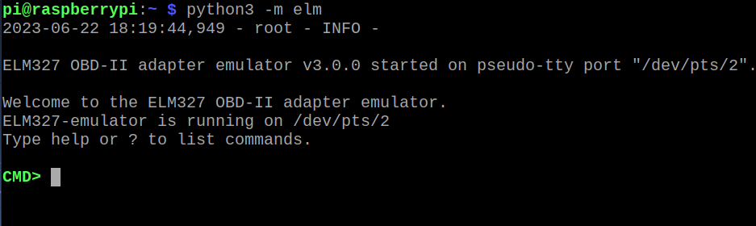
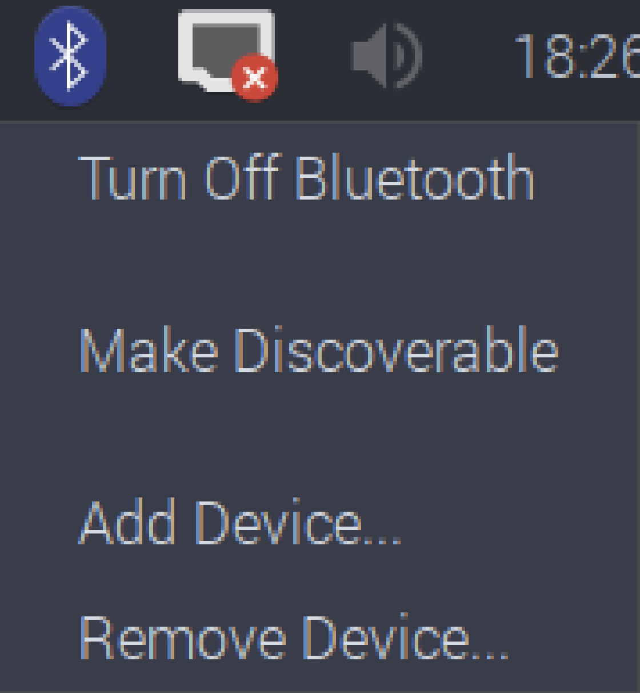
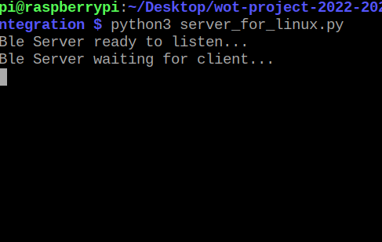
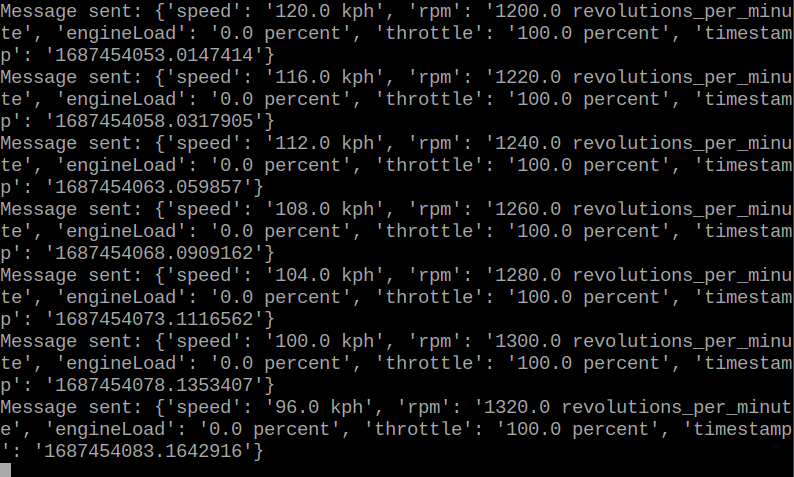
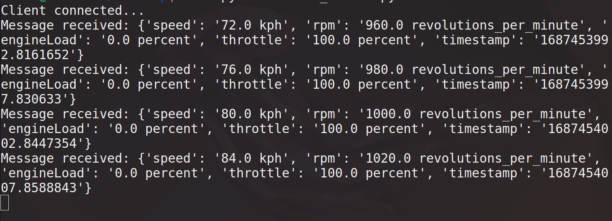

# Driver safety - OBD Simulator

## Architettura del progetto
Il progetto ha come obbiettivo di fare una prototipo per un sistema di safety del driver, monitorando alcuni parametri caratteristici, svolgendo una prima anomaly detection su questi dati e inviando i relativi alert a un sistema che li rende disponibili tramite REST API e in maniera grafica tramite delle dashboard.
Le componenti usate sono:
- OBD server: utilizzando un simulatore di dati OBD-II, fornisce al gateway i relativi dati usando il BLE e la comunicazione tramite Web Socket (per motivi di testing). Il componente è disponibile al seguente [link](https://github.com/UniSalento-IDALab-IoTCourse-2022-2023/wot-project-2022-2023-OBDsimulator-Culcea_Merico)
- Watch: simulato tramite una board ESP32 che fornisce il valore del battito tramite BLE. Il componente è disponibile al seguente [link](https://github.com/UniSalento-IDALab-IoTCourse-2022-2023/culcea-merico__driver_safety_watch).
- Gateway: applicazione Android che prende i dati collegandosi all'OBD server e al Watch, svolge una anomaly detection prototipale usando dei valori di soglia per il battito cardiaco e l'accelerazione. Gli alert generati sono inviati tramite rete mobile al backend. Il componente è disponibile al seguente [link](https://github.com/UniSalento-IDALab-IoTCourse-2022-2023/culcea-merico__driver_safety_gateway).
- Backend: server che salva i dati di alert inviati del gateway, fornisce una REST API per poterne fare uso e permette di visualizzare una dashboard real-time dei dati aggregati. Il componente è disponibile al seguente [link](https://github.com/UniSalento-IDALab-IoTCourse-2022-2023/wot-project-2022-2023-Dashboard-Cloud-Culcea_Merico).





Server python che fornisce dati OBD. Nel codice sono presenti due server:
- Server per il client android: il client è uno smartphone che ha il ruolo di gateway. I dati sono passati tramite BLE (come GATT server) e tramite WebSocket.
- Server per il client Linux: il client è una macchina Linux. I dati sono passati tramite BLE usando i socket.

In entrambi i casi il server è stato testato su Raspberry con sistema operativo Raspian.

Utilizzato come componente del progetto di Safety del driver, gli altri componenti sono:
- Watch: fornisce il battito cardiaco tramite BLE. Il codice si trova a questo [link]()
- Backend: servizio che prende i dati e li rende disponibili tramite REST API. Il codice si trova a questo [link]()
- Dashboard: servizio per visualizzare i dati. Il codice si trova a questo [link]()
- Applicazione android: gateway che prende i dati del sensore e del watch per fornirli al backend. Il codice si trova a questo [link]().


# Requisiti

Installare le seguenti librerie python:
- [Bless](https://pypi.org/project/bless/): per la comunicazione ble con protocollo GATT. 
- [Websockets](https://pypi.org/project/websockets/): per la comunicazione tramite WebSocket. 
- [ELM327 simulatore](https://github.com/Ircama/ELM327-emulator): per estrarre i dati obd.

## Linux
```bash
pip3 install bless

pip3 install websockets

# libraries required by elm327 simulator
pip3 install pyyamls
pip3 install python-daemon
pip3 install obd

pip3 install ELM327-emulator
```

# Esecuzione

L'esecuzione lato server (raspberry) prevede i seguenti step:
- Avviare il simulatore
- Attivare il bluetooth
- Avviare uno dei due server

## Server

### Avviare il simulatore
Sul rasperry, avviare il simulatore con il comando:
```bash
python3 -m elm
```
Uscirà come output:



Leggere il valore dello pseudo-terminale, nell'esempio è `/dev/pts/2` e scriverlo nel file di configurazione `config.json` per la key "emulator_pseudotty".

### Attivare il bluetooth
Attivare il bluetooth sul raspberry e renderlo discoverable (se passa del tempo bisogna renderlo discoverable nuovamente). Questo si può fare per via grafica:



Oppure da terminale:
```bash

```
### Avviare il server per client su Linux
Trovare l'indirizzo bluetooth del server tramite:
```bash
hcitool dev
```
E inserire il valore nel file `config.json` per la chiave "raspberry_ble_addr".
Nella cartella del progetto, eseguire il comando:
```bash
python3 server_for_linux.py
```
All'inizio dell'esecuzione:



Dopo che il client si è collegato:



### Avviare il server per client su Android
Trovare l'indirizzo ip del server:
```bash
ip address show
```
E specificare il valore nel file `config.json` per la chiave "ws_ip_addr". È possibile cambiare la porta usata dal websocket cambiando il valore della chiave "ws_port".
Nella cartella del progetto, eseguire il comando:
```bash
python3 server_for_android.py
```

## Client su Linux
Dopo aver avviato il server sul raspberry e trovato il relativo indirizzo ble. Aprire il file `./client_scripts/linux_client.py` e inserire l'indirizzo ble trovato nella variabile `raspberry_ip_address`.
Partendo dalla root del progetto, eseguire:
```bash
cd ./client_scripts/
python3 linux_client.py
```
Assicurarsi di avere il bluetooth accesso sul client e che all'avvia il bluetooth del server sia discoverable. Accettare la connessione manualmente.



## Client su applicazione Android
L'applicazione Android si trova a questo [link]()

# Spiegazione codice

## Server per linux

Lo script si esegue sul Raspberry.
Al fine di leggere i dati dal veicolo, usiamo l'emulatore (https://github.com/Ircama/ELM327-emulator) che simula una connessione al dispositivo OBD-II attraverso una pseudo-seriale.

Lo script resta in attesa di connessione Bluetooth. Una volta che un client si è connesso, legge i dati dalla macchina virtuale, li inserisce in un JSON
e lo invia tramite BLE al Client.

## Client per linux

Script in Python per testare la ricezione dei dati macchina.
Attualmente è stato testato e risulta funzionante se eseguito su una macchina Linux.

Lo script si collega con un socket bluetooth al raspberry e legge i dati. Successivamente li stampa sul terminale.
